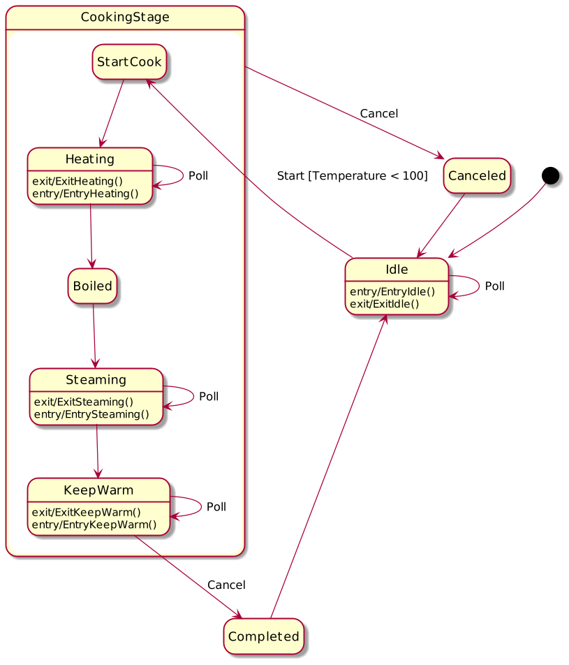

# state_machine_framework

This is a state machine framework running on AVR devices. In this framework an example that simulates the working process of a rice cooker is contained. The code is configured for atmega328p (on an Arduino nano board). With some minor adaption, this framework can also be used on other AVR devices or even on other MCU platforms.

This state machine framkework is designed based on David Lafreniere's excellent work of [State Machine Design in C](https://www.codeproject.com/Articles/1275479/State-Machine-Design-in-C)

## About the state machine framework

### This state machine features with

* table-driven state transition
* entry, exit and guard conditions for transition
* event emision mechanism
* runtime and compile-time assertion

### This stame machine doesnot feature with

* thread safty

## Explaination of the rice cooker example

In this example, a rice cooker is smulated to deminstrate the cooking process. Note that he rice cooker model is significantly simplfied to avoid complicated conceps behind it.

Here is the state diagram of the rice cooker generated by [PlantUML](https://plantuml.com/en/).

In this example, UART port is configured and user can see see the status of the rice cooker as well as issue command to it in serial monitor. Baud rate is 9600 by default. 

1. After starting the state machine, rice cooker enters and stays in idle state.

2. Use may type "s" to start the rice cooker. Guard function ensures that rice cooker can start cooking only when temperature of the rice cooker is lower than 100 (Celsius degree).

3. When rice cooker is started, it goes into heating state and temperature status is polled cyclically. If the temperature has not reached 100, then it will continously perform heating.

4. As long as temperature reaches 100, it goes into steaming state. Temperature keeps at 100 and the timer is polled. If the timer has not reached 10 (min), then it will continously perform steaming.

5. As long as timer reaches 10, it goes into keep warm state. The temperature will drop back to 80 and keep at 80 forever until user type "c" to cancel keep warm and go back to idle state.

6. User can issue "c" to cancel cooking at any time.